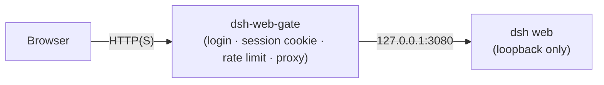

<div align="center">

# dsh-web-gate

**A zero-dependency authentication gateway for the [DeepSeek Harness](https://github.com/deepseek-ai/deepseek-harness) Web GUI.**

A tiny, auditable reverse proxy that puts a password login in front of the DSH Web GUI — static pages, the `/api` JSON-RPC + SSE transport, and WebSocket upgrades.

[](https://github.com/wayneleelwc/dsh-web-gate/actions/workflows/ci.yml)
[](LICENSE)
[](#prerequisites)
[](#features)
[](#tests)

</div>

`dsh-web-gate` is a small, dependency-free reverse proxy written in plain Node.js (ESM). It uses **only `node:crypto`** — no npm packages, no build step — and protects all three channels the DSH Web GUI uses. It mirrors the security design of the [Hermes Agent `dashboard_auth/basic`](https://github.com/NousResearch/hermes-agent/blob/main/plugins/dashboard_auth/basic/__init__.py) provider and the reverse-proxy auth strategy recommended by [Open WebUI](https://docs.openwebui.com/ecosystem/computer/phone-and-remote/reverse-proxy/).



## Table of Contents

- [Features](#features)
- [Background](#background)
- [Installation](#installation)
  - [Prerequisites](#prerequisites)
  - [Quick start](#quick-start)
- [Usage](#usage)
  - [CLI](#cli)
  - [Changing the password](#changing-the-password)
- [Configuration](#configuration)
- [Gateway endpoints](#gateway-endpoints)
- [Deployment](#deployment)
  - [Server](#server)
  - [Docker](#docker)
  - [systemd](#systemd)
  - [TLS](#tls)
- [Security](#security)
- [Project structure](#project-structure)
- [Development](#development)
- [FAQ](#faq)
- [Roadmap](#roadmap)
- [Contributing](#contributing)
- [License](#license)

## Features

- **Real password authentication** — memory-hard `scrypt` hashing (N=2^14, r=8, p=1, matching Hermes), constant-time comparison. No plaintext password at rest, in memory, or in logs.
- **Stateless sessions** — HMAC-SHA256-signed `access` (12h) + `refresh` (30d) cookies; `HttpOnly`, `SameSite=Strict`; transparent silent renewal when the access token lapses.
- **Password change logs everyone out** — a `pv` (password-generation) claim makes every old session invalid the moment the password changes, without scanning a session store.
- **Brute-force protection** — per-IP login rate limiting with lockout, plus an optional global token bucket.
- **CSRF protection** — `SameSite=Strict` cookies and same-origin checks on the gateway's own write endpoints; DSH's own `/api` trust fence keeps working.
- **Full three-channel proxying** — static assets, `/api` (including SSE streaming), and WebSocket upgrades, all authenticated before forwarding.
- **Password reset in a settings page** — visit `/settings` after login, or use `dsh-web-gate set-password`.
- **Zero dependencies, zero build** — `node bin/dsh-web-gate.js` just runs.
- **Fail-closed** — refuses to start without a password unless `--insecure` is passed explicitly (with a loud warning).

## Background

The DSH `webServer` service is a *route registry* (`register` / `registerFallback` / `registerUpgrade`) with **no middleware hook and no built-in auth layer** — its `/api` trust fence states explicitly that it is "not an auth layer". The GUI is served over three independent channels, so an in-process "plugin" that gates all of them would have to seize the single fallback seat and reimplement every route, coupling itself to DSH internals.

The mature, portable approach — the one Open WebUI recommends — is a **reverse proxy**: keep DSH on loopback and authenticate at the front door. This is zero-invasion to DSH, independently deployable, and can itself sit behind nginx/Caddy for TLS.

For the full design rationale and threat model, see [`docs/architecture.md`](docs/architecture.md) and [`docs/security.md`](docs/security.md).

## Installation

### Prerequisites

- [Node.js](https://nodejs.org/) `>= 20` (no npm install step — the gateway has zero dependencies).

### Quick start

The DSH Web GUI listens on `127.0.0.1:3080` by default; the gateway listens on `127.0.0.1:3090` and proxies to it.

```bash
git clone https://github.com/wayneleelwc/dsh-web-gate.git
cd dsh-web-gate

# Set the initial password (consumed once, stored as an scrypt hash).
DSH_WEB_GATE_PASSWORD='your-strong-password' node bin/dsh-web-gate.js start
```

Open `http://127.0.0.1:3090`, enter the password, and you are in.

> Alternatively, run `node bin/dsh-web-gate.js start` without `DSH_WEB_GATE_PASSWORD` to set the password interactively on first boot.

## Usage

### CLI

```bash
node bin/dsh-web-gate.js start              # start the gateway (default command)
node bin/dsh-web-gate.js hash-password      # print an scrypt hash (for pre-seeding the state file)
node bin/dsh-web-gate.js set-password       # change the password in the state file (bumps pv, logs everyone out)
```

### Changing the password

- **Web**: after login, open `http://127.0.0.1:3090/settings` and submit the current password plus a new one. All other logged-in sessions are invalidated immediately.
- **CLI**: `node bin/dsh-web-gate.js set-password --state /path/to/state.json`.

## Configuration

Three layers, highest precedence first: **CLI flags > `DSH_WEB_GATE_*` environment variables > `dsh-web-gate.config.json` > built-in defaults**.

### Environment variables

| Variable | Default | Description |
| --- | --- | --- |
| `DSH_WEB_GATE_HOST` | `127.0.0.1` | Listen host (`0.0.0.0` for public) |
| `DSH_WEB_GATE_PORT` | `3090` | Listen port |
| `DSH_WEB_GATE_UPSTREAM_HOST` | `127.0.0.1` | DSH Web GUI host |
| `DSH_WEB_GATE_UPSTREAM_PORT` | `3080` | DSH Web GUI port |
| `DSH_WEB_GATE_USERNAME` | `admin` | Session subject (single user) |
| `DSH_WEB_GATE_PASSWORD` | — | Initial password (first run only; stored as scrypt hash) |
| `DSH_WEB_GATE_ACCESS_TTL` | `43200` | Access token lifetime (seconds) |
| `DSH_WEB_GATE_REFRESH_TTL` | `2592000` | Refresh token lifetime (seconds) |
| `DSH_WEB_GATE_COOKIE_NAME` | `dsh_web_gate` | Cookie prefix (`<name>_access` / `<name>_refresh`) |
| `DSH_WEB_GATE_COOKIE_SECURE` | `false` | Set the `Secure` cookie flag (required for HTTPS) |
| `DSH_WEB_GATE_COOKIE_SAMESITE` | `Strict` | `Strict` / `Lax` / `None` |
| `DSH_WEB_GATE_LOGIN_MAX_ATTEMPTS` | `5` | Failures before lockout |
| `DSH_WEB_GATE_LOGIN_WINDOW_MS` | `900000` | Failure counting window (ms) |
| `DSH_WEB_GATE_LOGIN_LOCKOUT_MS` | `900000` | Lockout duration (ms) |
| `DSH_WEB_GATE_GLOBAL_LIMIT_ENABLED` | `false` | Enable the global token bucket |
| `DSH_WEB_GATE_STATE` | `./dsh-web-gate.state.json` | State file (password hash + signing key, mode 0600) |
| `DSH_WEB_GATE_TRUST_PROXY` | `false` | Trust `X-Forwarded-*` (only behind a trusted proxy) |
| `DSH_WEB_GATE_LOG_REQUESTS` | `false` | Log one line per request |
| `DSH_WEB_GATE_INSECURE` | `false` | Disable authentication (**dangerous**) |

See [`config.example.json`](config.example.json) for the config-file form.

### CLI flags

```text
--config <path>      JSON config file
--host <host>        listen host
--port <port>        listen port
--upstream-host      DSH host
--upstream-port      DSH port
--state <path>       state file
--log-requests       log one line per request
--insecure           disable the auth gate
--version, -v        print the version
```

## Gateway endpoints

| Method | Path | Auth | Description |
| --- | --- | --- | --- |
| `GET` | `/login` | — | Login page (redirects to `/` if already authenticated) |
| `POST` | `/auth/login` | — | Verify password, set session cookies, redirect |
| `POST` | `/auth/logout` | — | Revoke presented tokens and clear cookies |
| `POST` | `/auth/change-password` | ✅ | Change password, bump `pv`, re-mint the current session |
| `GET` | `/settings` | ✅ | Change-password page |
| `GET` | `/healthz` | — | Liveness probe |
| `*` | everything else | ✅ | Proxied to the upstream DSH Web GUI |

Unauthenticated `/api/*` requests receive `401`; unauthenticated navigations are redirected to `/login`.

## Deployment

### Server

1. Pin DSH to loopback and register the gateway's public authority so DSH's `/api` trust fence accepts it:

   ```bash
   dsh web --host 127.0.0.1 --port 3080 --trusted-host <your-host-or-ip>:3090
   ```

2. Run the gateway on the public interface:

   ```bash
   DSH_WEB_GATE_HOST=0.0.0.0 DSH_WEB_GATE_PORT=3090 \
   DSH_WEB_GATE_PASSWORD='strong-password' \
   node bin/dsh-web-gate.js start --state /var/lib/dsh-web-gate/state.json
   ```

### Docker

```bash
docker build -t dsh-web-gate .
docker run -d --name dsh-web-gate \
  -p 3090:3090 \
  -e DSH_WEB_GATE_HOST=0.0.0.0 \
  -e DSH_WEB_GATE_UPSTREAM_HOST=host.docker.internal \
  -e DSH_WEB_GATE_UPSTREAM_PORT=3080 \
  -e DSH_WEB_GATE_PASSWORD='strong-password' \
  -v dsh-web-gate-state:/data \
  dsh-web-gate
```

A compose example is in [`docker-compose.example.yml`](docker-compose.example.yml).

### systemd

A hardened unit is provided at [`deploy/dsh-web-gate.service`](deploy/dsh-web-gate.service).

### TLS

The gateway itself speaks plain HTTP. In production, terminate TLS in front of it (nginx, Caddy, Cloudflare) and set `DSH_WEB_GATE_COOKIE_SECURE=true`.

## Security

The gateway answers "who may enter the Web GUI". It does **not** provide transport encryption, multi-user roles, or SSO — those belong in front of it. See [`docs/security.md`](docs/security.md) for the full threat-model table and a deployment checklist. To report a vulnerability, open an issue or contact the maintainer directly.

## Project structure

```
bin/dsh-web-gate.js    CLI entry (start / hash-password / set-password)
src/crypto.js          scrypt hashing, HMAC signing, constant-time comparison
src/tokens.js          access/refresh tokens, pv generation, jti revocation
src/ratelimit.js       login limiter + token bucket
src/auth.js            session mint/verify/renew, login/logout/change-password
src/proxy.js           HTTP (SSE) + WebSocket reverse proxy
src/server.js          HTTP server wiring and route dispatch
src/config.js          config parsing and validation
src/state.js           state file (0600) atomic read/write
src/pages.js           login / settings pages (pure HTML, no script, strict CSP)
test/                  node:test unit + end-to-end tests
```

## Development

### Tests

```bash
npm test   # equivalent to `node --test "test/*.test.js"`
```

The 55 tests cover hashing round-trips and tamper detection, token signing/expiry/pv-invalidation/revocation, rate-limit lockout and pruning, config validation, the CLI, login/logout/change-password, SSE streaming proxying, WebSocket gating and proxying, header-handling (X-Forwarded-*), and security headers.

## FAQ

**Why a reverse proxy instead of a DSH plugin?**
DSH's HTTP layer has no middleware hook and no auth layer; gating all three channels in-process would mean replacing the static, `/api`, and WebSocket route owners. A reverse proxy is the zero-invasion, industry-standard approach. See [Background](#background).

**Does the gateway support multiple users or SSO?**
No — it is a single-password gate by design. For multi-user/OIDC, put an OAuth2 proxy (Authelia, oauth2-proxy) in front.

**Where is the password stored?**
Only as an scrypt hash in `dsh-web-gate.state.json` (mode 0600). Plaintext exists only transiently during first-run setup and password changes.

**What happens on restart?**
The password hash and signing secret are persisted in the state file, so sessions survive a restart. The in-memory `jti` revocation list is cleared (a documented trade-off; see [`docs/security.md`](docs/security.md)).

## Roadmap

- [ ] Distributed rate limiting for multi-replica deployments
- [ ] Persistent `jti` revocation across restarts
- [ ] Optional OIDC / SSO support
- [ ] Optional request audit logging

## Contributing

Contributions are welcome. Please read [`CONTRIBUTING.md`](CONTRIBUTING.md) before opening a PR. Report bugs and ideas via [issues](https://github.com/wayneleelwc/dsh-web-gate/issues).

## License

[MIT](LICENSE) © 2026 [wayneleelwc](https://github.com/wayneleelwc)
