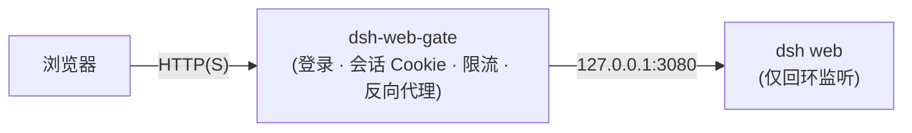

<div align="center">

# dsh-web-gate

**为 [DeepSeek Harness](https://github.com/deepseek-ai/deepseek-harness) Web GUI 打造的零依赖口令网关。**

一个极小、可审计的反向代理，为 DSH Web 界面加一道口令登录——覆盖静态页面、`/api` JSON-RPC + SSE 传输、WebSocket 升级三条通道。

[English](README.md) · 中文

[](https://github.com/wayneleelwc/dsh-web-gate/actions/workflows/ci.yml)
[](LICENSE)
[](#前置条件)
[](#特性)
[](#测试)

</div>

`dsh-web-gate` 是一个用纯 Node.js（ESM）编写、**零第三方依赖**的反向代理，只使用 `node:crypto`——无需 npm 安装、无需构建步骤。它借鉴了 [Hermes Agent `dashboard_auth/basic`](https://github.com/NousResearch/hermes-agent/blob/main/plugins/dashboard_auth/basic/__init__.py) 的安全设计，以及 [Open WebUI](https://docs.openwebui.com/ecosystem/computer/phone-and-remote/reverse-proxy/) 推荐的反向代理鉴权策略。



## 目录

- [特性](#特性)
- [背景](#背景)
- [安装](#安装)
  - [前置条件](#前置条件)
  - [快速开始](#快速开始)
- [用法](#用法)
  - [CLI](#cli)
  - [修改口令](#修改口令)
- [配置](#配置)
- [网关端点](#网关端点)
- [部署](#部署)
- [安全](#安全)
- [项目结构](#项目结构)
- [开发](#开发)
- [FAQ](#faq)
- [路线图](#路线图)
- [贡献](#贡献)
- [许可](#许可)

## 特性

- **真实口令认证**——内存硬函数 `scrypt` 哈希（N=2^14, r=8, p=1，与 Hermes 一致）、恒定时间比较；磁盘、内存、日志中均无明文口令。
- **无状态会话**——HMAC-SHA256 签名的 `access`（12h）+ `refresh`（30d）Cookie；`HttpOnly`、`SameSite=Strict`；access 过期后自动静默续期。
- **改密即全员下线**——`pv`（口令代际）声明使改密后所有旧会话立即失效，无需扫描会话表。
- **防暴力破解**——按 IP 的登录与改密限流 + 锁定，可选全局令牌桶。
- **CSRF 防护**——`SameSite=Strict` Cookie + 网关自身写端点的同源校验；DSH 自身的 `/api` 信任栅栏继续生效。
- **三条通道全代理**——静态资源、`/api`（含 SSE 流式）、WebSocket 升级，全部先鉴权后转发。
- **设置页改密**——登录后访问 `/settings`，或使用 `dsh-web-gate set-password`。
- **零依赖、零构建**——`node bin/dsh-web-gate.js` 直接运行。
- **Fail-closed**——未配置口令时拒绝启动，除非显式 `--insecure`（并打印醒目警告）。

## 背景

DSH 的 `webServer` 服务是一个**路由注册表**（`register` / `registerFallback` / `registerUpgrade`），**没有中间件钩子、也没有内置认证层**——其 `/api` 信任栅栏明确说明「不是认证层」。GUI 由三条独立通道承载，任何进程内「插件」若要统一鉴权，都必须抢占唯一的 fallback 座位并重写全部路由，与 DSH 内部实现强耦合。

成熟的、可移植的做法（也是 Open WebUI 官方推荐的做法）是**反向代理**：让 DSH 只监听回环，由网关在门口完成认证。这对 DSH 零侵入、可独立部署，还能继续套在 nginx/Caddy 之后做 TLS。

完整设计取舍与威胁模型见 [`docs/architecture.md`](docs/architecture.md) 与 [`docs/security.md`](docs/security.md)。

## 安装

### 前置条件

- [Node.js](https://nodejs.org/) `>= 20`（无需 npm install——网关零依赖）。

### 快速开始

DSH Web GUI 默认监听 `127.0.0.1:3080`，网关默认监听 `127.0.0.1:3090` 并反代它。

```bash
git clone https://github.com/wayneleelwc/dsh-web-gate.git
cd dsh-web-gate

# 设置初始口令（仅首次运行消费，之后以 scrypt 哈希存储）。
DSH_WEB_GATE_PASSWORD='你的强口令' node bin/dsh-web-gate.js start
```

打开 `http://127.0.0.1:3090`，输入口令即可进入。

> 不带 `DSH_WEB_GATE_PASSWORD` 直接运行 `node bin/dsh-web-gate.js start`，会在首次启动时交互式设置口令。

## 用法

### CLI

```bash
node bin/dsh-web-gate.js start              # 启动网关（默认命令）
node bin/dsh-web-gate.js hash-password      # 打印 scrypt 哈希（用于预置状态文件）
node bin/dsh-web-gate.js set-password       # 修改状态文件中的口令（bump pv，全员下线）
```

### 修改口令

- **网页**：登录后打开 `http://127.0.0.1:3090/settings`，输入当前口令与新口令。所有其他已登录会话立即失效。
- **命令行**：`node bin/dsh-web-gate.js set-password --state /path/to/state.json`。

## 配置

三层配置，优先级从高到低：**CLI 参数 > 环境变量 `DSH_WEB_GATE_*` > 配置文件 `dsh-web-gate.config.json` > 内置默认值**。

| 变量 | 默认值 | 说明 |
| --- | --- | --- |
| `DSH_WEB_GATE_HOST` | `127.0.0.1` | 监听地址（公网用 `0.0.0.0`） |
| `DSH_WEB_GATE_PORT` | `3090` | 监听端口 |
| `DSH_WEB_GATE_UPSTREAM_HOST` | `127.0.0.1` | DSH Web GUI 地址 |
| `DSH_WEB_GATE_UPSTREAM_PORT` | `3080` | DSH Web GUI 端口 |
| `DSH_WEB_GATE_USERNAME` | `admin` | 会话主体（单用户） |
| `DSH_WEB_GATE_PASSWORD` | — | 初始口令（仅首次运行） |
| `DSH_WEB_GATE_ACCESS_TTL` | `43200` | access token 寿命（秒） |
| `DSH_WEB_GATE_REFRESH_TTL` | `2592000` | refresh token 寿命（秒） |
| `DSH_WEB_GATE_COOKIE_NAME` | `dsh_web_gate` | Cookie 前缀（`<name>_access` / `<name>_refresh`） |
| `DSH_WEB_GATE_COOKIE_SECURE` | `false` | 设置 `Secure` Cookie 标志（HTTPS 必开） |
| `DSH_WEB_GATE_COOKIE_SAMESITE` | `Strict` | `Strict` / `Lax` / `None` |
| `DSH_WEB_GATE_LOGIN_MAX_ATTEMPTS` | `5` | 锁定前的失败次数 |
| `DSH_WEB_GATE_LOGIN_WINDOW_MS` | `900000` | 失败计数窗口（毫秒） |
| `DSH_WEB_GATE_LOGIN_LOCKOUT_MS` | `900000` | 锁定时长（毫秒） |
| `DSH_WEB_GATE_GLOBAL_LIMIT_ENABLED` | `false` | 启用全局令牌桶限流 |
| `DSH_WEB_GATE_STATE` | `./dsh-web-gate.state.json` | 状态文件（口令哈希 + 签名密钥，0600） |
| `DSH_WEB_GATE_TRUST_PROXY` | `false` | 信任 `X-Forwarded-*`（仅在可信代理之后开启） |
| `DSH_WEB_GATE_LOG_REQUESTS` | `false` | 每个请求记录一行日志 |
| `DSH_WEB_GATE_INSECURE` | `false` | 关闭认证（**危险**） |

完整配置见 [`config.example.json`](config.example.json)。

## 网关端点

| 方法 | 路径 | 鉴权 | 说明 |
| --- | --- | --- | --- |
| `GET` | `/login` | — | 登录页（已登录则跳转 `/`） |
| `POST` | `/auth/login` | — | 校验口令、下发会话 Cookie、重定向 |
| `POST` | `/auth/logout` | — | 吊销当前 token、清 Cookie |
| `POST` | `/auth/change-password` | ✅ | 改密、bump `pv`、为当前会话重新签发 |
| `GET` | `/settings` | ✅ | 改密页 |
| `GET` | `/healthz` | — | 存活探针 |
| `*` | 其它所有路径 | ✅ | 反代到上游 DSH Web GUI |

未认证的 `/api/*` 请求返回 `401`；未认证的页面导航重定向到 `/login`。

## 部署

1. 让 DSH 只监听回环，并登记网关的公开 authority，使 DSH 的 `/api` 信任栅栏放行：

   ```bash
   dsh web --host 127.0.0.1 --port 3080 --trusted-host <你的域名或IP>:3090
   ```

2. 让网关监听公网接口：

   ```bash
   DSH_WEB_GATE_HOST=0.0.0.0 DSH_WEB_GATE_PORT=3090 \
   DSH_WEB_GATE_PASSWORD='强口令' \
   node bin/dsh-web-gate.js start --state /var/lib/dsh-web-gate/state.json
   ```

- **Docker**：见 [`Dockerfile`](Dockerfile) 与 [`docker-compose.example.yml`](docker-compose.example.yml)。
- **systemd**：见 [`deploy/dsh-web-gate.service`](deploy/dsh-web-gate.service)。
- **TLS**：网关本身是纯 HTTP，生产环境在它前面接 nginx/Caddy/Cloudflare 终止 TLS，并设 `DSH_WEB_GATE_COOKIE_SECURE=true`。

## 安全

网关回答的是「谁可以进入 Web 界面」这一层。它**不**提供传输加密、多用户角色或 SSO——这些属于它前面那一层。完整的威胁模型表与部署检查清单见 [`docs/security.md`](docs/security.md)。漏洞请私密上报（不要开公开 issue）。

## 项目结构

```
bin/dsh-web-gate.js    CLI 入口（start / hash-password / set-password）
src/crypto.js          scrypt 哈希、HMAC 签名、恒定时间比较
src/tokens.js          access/refresh token、pv 代际、jti 吊销
src/ratelimit.js       登录限流 + 令牌桶
src/auth.js            会话签发/校验/续期、登录/登出/改密逻辑
src/proxy.js           HTTP（SSE）+ WebSocket 反向代理
src/server.js          HTTP 服务装配与路由分发
src/config.js          配置解析与校验
src/state.js           状态文件（0600）原子读写
src/pages.js           登录 / 设置改密页（纯 HTML，无脚本，严格 CSP）
test/                  node:test 单元 + 端到端测试
```

## 开发

### 测试

```bash
npm test   # 等价于 node --test "test/*.test.js"
```

61 个测试覆盖哈希往返与篡改、token 签发/过期/pv 失效/吊销、限流锁定与清理、配置校验、CLI、登录/登出/改密、SSE 流式透传、WebSocket 鉴权与透传、头部处理（X-Forwarded-*）与安全响应头。

## FAQ

**为什么用反向代理而不是 DSH 插件？**
DSH 的 HTTP 层没有中间件钩子、也没有认证层；进程内对三条通道统一鉴权意味着替换静态、`/api`、WebSocket 三个路由所有者。反向代理是零侵入、行业标准的做法。见[背景](#背景)。

**支持多用户或 SSO 吗？**
不支持——它刻意做成单口令网关。需要多用户/OIDC 时，在前面加 OAuth2 代理（Authelia、oauth2-proxy）。

**口令存在哪里？**
仅以 scrypt 哈希存于 `dsh-web-gate.state.json`（0600）。明文只在首次设置与改密的瞬间存在。

**重启后会话还在吗？**
在。口令哈希与签名密钥持久化于状态文件；内存中的 `jti` 吊销表会清空（这是已记录在案的有意权衡，见 [`docs/security.md`](docs/security.md)）。

## 路线图

- [ ] 多副本部署的分布式限流
- [ ] 跨重启持久化的 `jti` 吊销
- [ ] 可选 OIDC / SSO 支持
- [ ] 可选请求审计日志

## 贡献

欢迎贡献。开 PR 前请先阅读 [`CONTRIBUTING.md`](CONTRIBUTING.md)。通过 [issues](https://github.com/wayneleelwc/dsh-web-gate/issues) 反馈问题与想法。

## 许可

[MIT](LICENSE) © 2026 [wayneleelwc](https://github.com/wayneleelwc)
